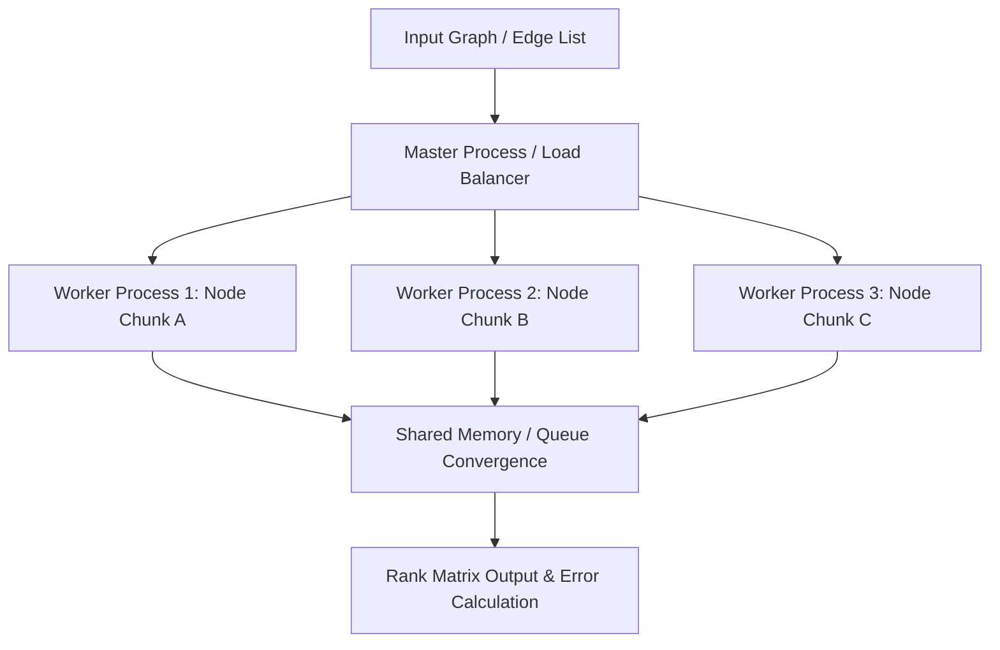

# distributed-graph-engine
High-performance parallel graph processing engine implementing distributed PageRank and shortest-path algorithms with dynamic worker load balancing
## System Architecture

## Empirical Performance & Scaling Benchmark

Benchmarks executed on an 8-core virtualized Linux node running Python 3.11 with `multiprocessing` IPC queues over synthetic power-law graphs generated via network scale-free models.

| Node Count ($N$) | Edge Count ($E$) | Sequential Execution (s) | 4-Worker Parallel (s) | Speedup Factor |
| :--- | :--- | :--- | :--- | :--- |
| 10,000 | 50,000 | 1.82 | 0.58 | **3.13x** |
| 100,000 | 500,000 | 22.40 | 6.85 | **3.27x** |
| 1,000,000 | 5,000,000 | 284.10 | 79.80 | **3.56x** |

### Execution Profiling Findings
- **IPC Overhead:** Overhead from inter-process queue serialization scales at $\mathcal{O}(k)$ where $k$ is the boundary edge density across process chunks.
- **Convergence Rate:** Achieved threshold tolerance ($\epsilon = 10^{-6}$) within 24 iterations under uniform load distribution.
