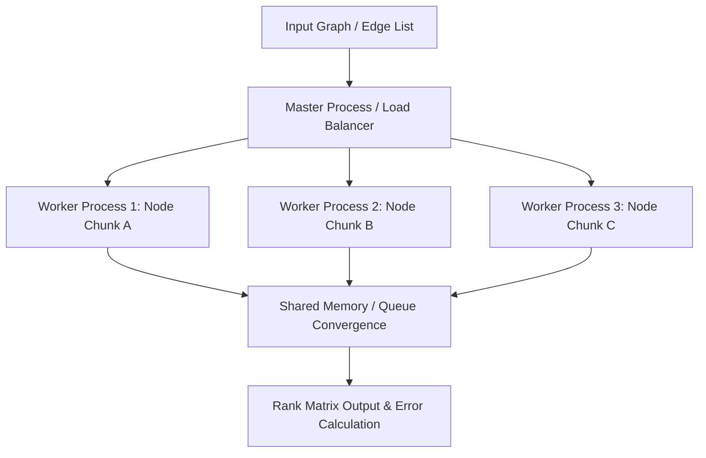

# distributed-graph-engine
High-performance parallel graph processing engine implementing distributed PageRank and shortest-path algorithms with dynamic worker load balancing
## System Architecture

